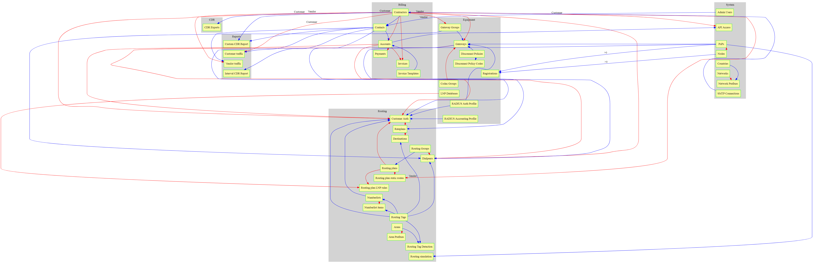

============
Dependencies
============

Dependencies between different configuration objects in Yeti (red-lines - absolute dependence (you can't create dependent object before you have configured object on which it depends; blue-lines - conditional dependence (you can create dependent object before you have configured object on which it depends)) are represented on the picture below:

