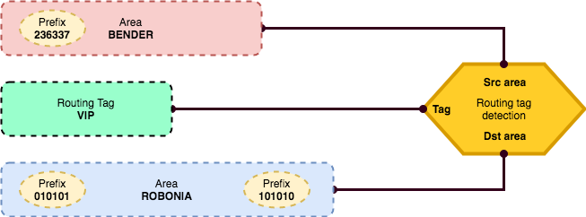
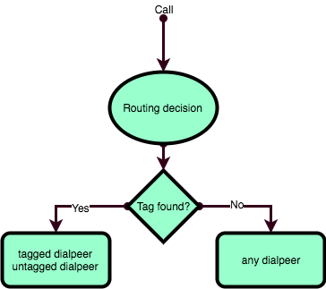

.. :orphan:

===============================================
Использование тэгов для приоритезации маршрутов
===============================================
Механизм тегов позволяет влиять на выбор маршрутов, на основании таких параметров как А(SRC) и/или B(DST) номера.

В данном процессе участвую следующие сущности Yeti:

1. Метка маршрутизации(Routing tags) - собственно тег роутинга.
2. Область(Areas) - области (может отражать некую географическую зону), которые содержат префиксы.
3. Префиксы зоны(Area prefixes) - справочник префиксов, которые относятся к той или иной области, в котором находятся A или B префиксы. 
4. Определитель метки маршрутизации(Routing tags detection) - место, в котором собираются воедино области, и теги.

Следующая картинка иллюстрирует процесс:

Мы хотим помочь нашему другу Бендеру, и предоставить ему скидку для звонков в Робонию.
Для этого нам нужно понимать, что звонит именно Бендер, отслеживая его А-номер, и что звонит он именно в Робонию(отслеживая
B-номера). Все остальные комбинации нас не интересуют и они должны обрабатываться по стандартным правилам.

Сначала, мы создали метку маршрутизации *VIP*, который далее будет назначаться на диалпир.
Затем, мы создали область *BENDER* в которой создали префикс *236337*.
Мы создали область *ROBONIA* к которой относятся префиксы *010101* и *101010*.
Наконец, мы создаем определитель метки маршрутизации, в которой устанавливаем созданные сущности в правильном порядке.

Любой звонок в системе проходит через механизм определения меток маршрутизации. Если будет установлено, что параметры
звонка сообветствуют определителю метки маршрутизации (то есть, SRC-номер *236337* звонит на номер *101010*) - такому звонку
будет присвоена соответствующая метка - в нашем случае *VIP*.

Теперь, нам необходимо подобрать или создать те диалпиры, которые должны обслуживать наши звонки и присвоить им соответствующую метку.

Важно понимать каким образом механизм маршрутизации Yeti используют метки для определения диалпиров. Этот процесс показан
на диаграмме:

То есть, если звонку присвоена метка, то сначала будут выбираться диалпиры содержащие метку, а затем все прочие подходящие.
Если же у звонка отсутствует метка, то в маршрутизации будут участвовать все диалпиры.