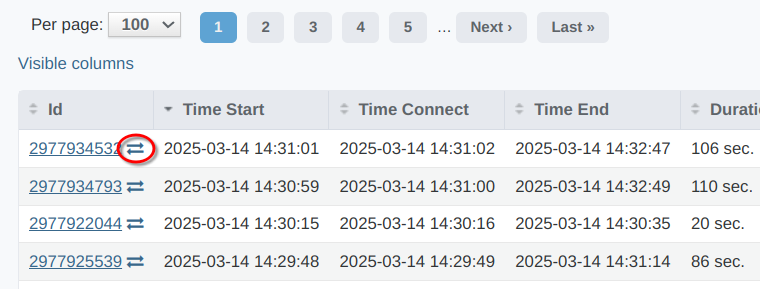
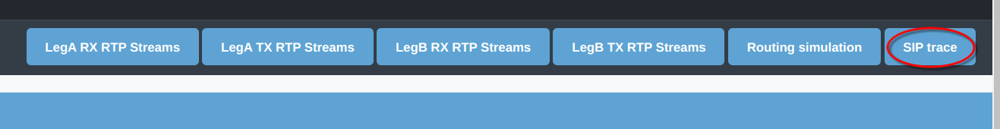

.. _troubleshooting:

===============
Troubleshooting
===============

Routing simulation
==================

In case of unexpected routing behavior - when yeti choosing unexpected Customer auths, Destinations, Dialpeers or Gateways Routing Simulation tools allow to collect routing logs.

There are two ways how to use Routing Simulation tool:

    - Manually from Routing -> Routing Simulation menu - In this case operator have to enter all call attributes manually.
    - From CDR. When you want to reproduce call routing of specicif call - you can click on "Routing Simulation" button on CDR Show page. In this call all call atributes will be copied from CDR automatically.

Results and last internal code

.. _troubleshooting_tracing:

Trace capturing
===============

For troubleshooting issues related to SIP signaling or RTP processing Yeti provides mechanism to capture traces in pcap format. There are few places where operator can enable this mechanism:

    * Dump Level in Customer auth object
    * Dump Level in Termination gateway object

Possible Dump Level values:

    * Capture nothing - Tracing disabled
    * Capture signaling traffic - SIP signaling traffic will be written to pcap file
    * Capture RTP traffic - RTP media traffic will be written to pcap file
    * Capture all traffic - Both - SIP and RTP media traffic will be written to pcap file

.. warning:: To save system resources it is recommended to use as low Dump Level as possible and disable tracing when it not needed

During enabling tracing Yeti will use maximum Dump Level value across Customer auth objects and all Termination gw that present in routing results.

In case of enabled trace CDR for call will contain link to pcap file on CDR->CDR History page:

|

Alternativly it is possible to download trace by clicking trace button on CDR Show page:

|

It is recommended to use wireshark to analyze pcap traces.

.. note:: Traces are not captured by sniffer on network level but written by SEMS SIP stack by mirroring data sent and received to/from sockets.

