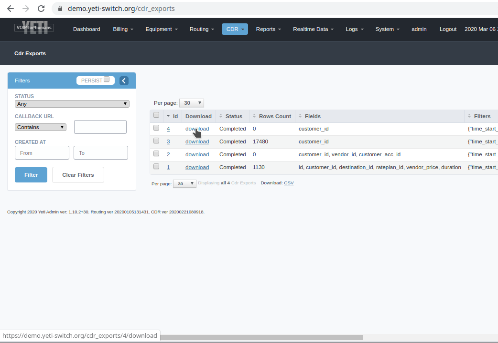

.. :maxdepth: 2

========================
CDR export configuration
========================

CDR export feature allows operator to unload CDR from database to CSV file. Yeti uses `PostgreSQL COPY <https://www.postgresql.org/docs/current/sql-copy.html>`_ method for CSV generation, so the file will be saved by PostgreSQL daemon.

    CDR export download link
    
Yeti Web interface uses Nginx `X-Accel-Redirect <https://nginx.org/en/docs/http/ngx_http_proxy_module.html>`_ mechanism to provide file download.
Web interface responds on download request with 200Ok with header ``X-Accel-Redirect: /x-redirect/cdr_export/4.csv``. Nginx should be configured to handle this redirection properly.

CDR database and yeti-web on the same server
--------------------------------------------

Edit ``/etc/nginx/sites-enabled/yeti-web`` and replace ``/x-redirect/cdr_export`` with the following content:
    
.. code-block:: nginx

    location /x-redirect/cdr_export {
        internal;
        alias /tmp;
    }
    
Where ``/tmp`` is the storage directory defined in ``/opt/yeti-web/config/yeti_web.yml``:

.. code-block:: yaml

    cdr_export:
        dir_path: "/tmp"
       
.. warning:: You can use any directory as ``cdr_export dir_path`` but this directory should be writable by ``postgres`` system user and readable by ``www-data`` system user.

Restart nginx service:

.. code-block:: console
    
    # systemctl restart nginx

CDR database and yeti-web located on different servers
------------------------------------------------------

Configure nginx on WEB interface server
~~~~~~~~~~~~~~~~~~~~~~~~~~~~~~~~~~~~~~~

Edit ``/etc/nginx/sites-enabled/yeti-web`` and replace ``/x-redirect/cdr_export`` with the following content:

.. code-block:: nginx

    location /x-redirect/cdr_export {
        internal;
        proxy_pass http://<CDR SERVER ADDRESS>:8080;
    }
    
Where **<CDR SERVER ADDRESS>** is IP address of remote CDR database server.
    
Configure nginx on CDR database server
~~~~~~~~~~~~~~~~~~~~~~~~~~~~~~~~~~~~~~

Install ``nginx`` package and add the next server block to ``/etc/nginx/nginx.conf``:

.. code-block:: nginx

        server {
                listen 8080;
                server_name _;
                root /tmp;

                allow <WEB INTERFACE SERVER ADDRESS>/32;
                deny all;
                
                location /x-redirect/cdr_export {
                        alias /tmp;
                }
        }

Where ``/tmp`` is ``cdr_export dir_path`` from ``/opt/yeti-web/config/yeti_web.yml`` config file and ``<WEB INTERFACE SERVER ADDRESS>`` is IP address of your web interface server.

.. warning:: Make sure you configure ``allow/deny`` ACL properly. Wrong nginx configuration will cause data leak especially if CDR server uses public IP address(we recommend using private IP for CDR db server).

Restart nginx service:
    
.. code-block:: console

    # systemctl restart nginx

