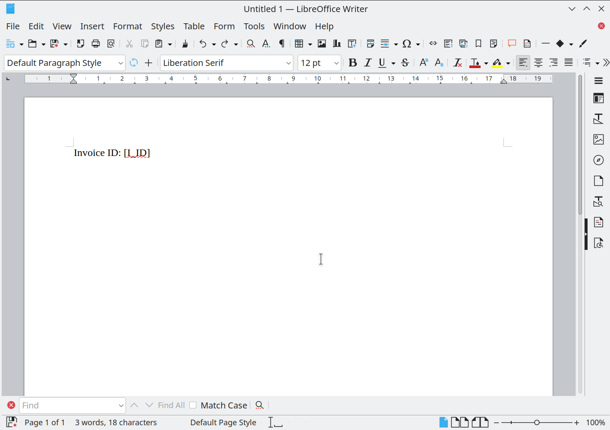

Invoice Templates
~~~~~~~~~~~~~~~~~

PDF document templates which will be used to generate invoice. Template - it is the file in .odt format with special placeholders.
Placeholders will be replaced with actual data during PDF document generation.
System can store many different templates and you can choose desired template for each account independently.

.. warning:: It is highly recommeded to use LibreOffice to create/edit invoice templates.

Invoice Template attributes
```````````````````````````
    Id
        Unique invoice temlpate id.
    Name
        Unique invoice template name.
    Filename 
        Name of file in .odt format with invoice template.
    Sha1
        Result of calculation of Secure Hash Algorithm 1 (SHA1) for the file with invoice template.
    Created at
        Date and time of the invoice template creation.
        

Placeholders
````````````

During document generation placeholders will be replaced with values.

List of supported scalar placeholders:

=================================   ========================================================================================
Placeholder                         Description
=================================   ========================================================================================
[A_NAME]                            Account name
[A_BALANCE]                         Account balance
[A_BALANCE_D]                       Account balance rounded
[A_MIN_BALANCE]                     Account minimal balance threshold
[A_MIN_BALANCE_D]                   Account minimal balance threshold rounded
[A_MAX_BALANCE]                     Account minimal balance threshold
[A_MAX_BALANCE_D]                   Account minimal balance threshold rounded
[A_INV_PERIOD]                      Account invoice period
[C_NAME]                            Contractor name
[C_ADDRESS]                         Contractor address
[C_PHONES]                          Contractor phones
[I_ID]                              ID of generated invoice
[I_REF]                             Reference of generated invoice
[I_CREATED_AT]                      Date and time of the invoice creation
[I_START_DATE]                      Begin of the invoice period
[I_END_DATE]                        End of invoice period
[I_TOTAL]                           Invoice total amount
[I_TOTAL_D]                         Invoice total amount rounded
[I_SPENT]                           Account spent amount
[I_SPENT_D]                         Account spent amount rounded
[I_EARNED]                          Account earned amount
[I_EARNED_D]                        Account earned amount rounded
[I_ORIG_CALLS_COUNT]                How many calls were originated by account(account acts as customer account)
[I_ORIG_SUCCESSFUL_CALLS_COUNT]     How many successful calls were originated by account   
[I_ORIG_CALLS_DURATIONM]            Originated calls duration in HH:MM format
[I_ORIG_CALLS_DURATION_D]           Originated calls duration in minutes(base 10)
[I_ORIG_CALLS_DURATION]             Originated calls duration in seconds
[I_ORIG_FIRST_CALL_AT]              Time of first originated call
[I_ORIG_LAST_CALL_AT]               Time of last originated call 
[I_ORIG_SPENT]                      Amount spent by account as fee for originated calls
[I_ORIG_SPENT_D]                    Rounded amount spent by account as fee for originated calls
[I_ORIG_EARNED]                     Amount earned by account as fee for originated calls(in case of reverse billing)
[I_ORIG_EARNED_D]                   Rounded Amount earned by account as fee for originated calls(in case of reverse billing)
[I_TERM_CALLS_COUNT]                How many calls were terminated to account(account acts as vendor account)
[I_TERM_SUCCESSFUL_CALLS_COUNT]     How many successful calls were terminated to account
[I_TERM_CALLS_DURATIONM]            Terminated calls duration in HH:MM format
[I_TERM_CALLS_DURATION_DEC]         Terminated calls duration in minutes(base 10)
[I_TERM_CALLS_DURATION]             Terminated calls duration in seconds
[I_TERM_FIRST_CALL_AT]              Time of first terminated call
[I_TERM_LAST_CALL_AT]               Time of last terminated call
[I_TERM_SPENT]                      Amount spent by account as fee for terminated calls(in case of reverse billing)
[I_TERM_SPENT_D]                    Rounded amount spent by account as fee for terminated calls(in case of reverse billing)
[I_TERM_EARNED]                     Amount earned by account as fee for terminated calls
[I_TERM_EARNED_D]                   Rounded Amount earned by account as fee for terminated calls
[I_SRV_SPENT]                       Amount spend by account as fee for services
[I_SRV_SPENT_D]                     Rounded amount spend by account as fee for services
[I_SRV_EARNED]                      Amount earned by account as fee for services
[I_SRV_EARNED_D]                    Rounded amount earned by account as fee for services
[T_SRV_TRANSACTIONS_COUNT]          Services transactions count
=================================   ========================================================================================


   
   How to insert scalar placeholder to invoice template
   

Tables placeholder
------------------

It is possible to have table data inserted in invoice. Currently these tables supported:

=============================== =====================================================================================
Table name                      Description
=============================== =====================================================================================
INV_ORIG_DST_TABLE              Calls originated by account, groupped by destination prefix(from Destination object)
INV_ORIG_DST_SUCC_TABLE         Successful calls originated by account, groupped by destination prefix
INV_ORIG_NETWORKS_TABLE         Calls originated by account, groupped by destination Network
INV_ORIG_NETWORKS_SUCC_TABLE    Successful calls originated by account, groupped by destination Network
INV_TERM_DST_TABLE              Calls terminated to account, groupped by destination prefix(from Dialpeer object)
INV_TERM_DST_SUCC_TABLE         Successful calls terminated to account, groupped by destination prefix
INV_TERM_NETWORKS_TABLE         Calls terminated to account, groupped by destination network
INV_TERM_NETWORKS_SUCC_TABLE    Successful calls terminated to account, groupped by destination network
INV_SRV_DATA_TABLE              Table of services related transactions
=============================== =====================================================================================



   
   How to insert table

INV_ORIG_DST_TABLE and INV_ORIG_DST_SUCC_TABLE
==============================================

========================        ============================================
Placeholder                     Description
========================        ============================================
[DST_PREFIX]                    Destination prefix
[COUNTRY]                       Country
[NETWORK]                       Network name
[RATE]                          Per minute rate
[CALLS_COUNT]                   Count of calls
[SUCCESSFUL_CALLS_COUNT]        Count of successful calls
[CALLS_DURATION]                Calls duration in seconds
[CALLS_DURATIONM]               Calls duration in MM:SS format
[CALLS_DURATION_DEC]            Calls duration in minutes(base 10)
[AMOUNT]                        Price of calls
[AMOUNT_DECORATED]              Rounded price
[FIRST_CALL_AT]                 Time of first call
[LAST_CALL_AT]                  Time of last call
========================        ============================================

        
INV_ORIG_NETWORKS_TABLE and INV_ORIG_NETWORKS_SUCC_TABLE
========================================================

==========================      ============================================
Placeholder                     Description
==========================      ============================================
[COUNTRY]                       Country
[NETWORK]                       Network name
[RATE]                          Per minute rate
[CALLS_COUNT]                   Count of calls
[SUCCESSFUL_CALLS_COUNT]        Count of successful calls
[CALLS_DURATION]                Calls duration in seconds
[CALLS_DURATIONM]               Calls duration in MM:SS format
[CALLS_DURATION_DEC]            Calls duration in minutes(base 10)
[AMOUNT]                        Price of calls
[AMOUNT_DECORATED]              Rounded price
[FIRST_CALL_AT]                 Time of first call
[LAST_CALL_AT]                  Time of last call
==========================      ============================================
          
          
INV_TERM_DST_TABLE and INV_TERM_DST_SUCC_TABLE
==============================================

==========================      ============================================
Placeholder                     Description
==========================      ============================================
[DST_PREFIX]                    Destination prefix
[COUNTRY]                       Country
[NETWORK]                       Network name
[RATE]                          Per minute rate
[CALLS_COUNT]                   Count of calls
[SUCCESSFUL_CALLS_COUNT]        Count of successful calls
[CALLS_DURATION]                Calls duration in seconds
[CALLS_DURATIONM]               Calls duration in MM:SS format
[CALLS_DURATION_DEC]            Calls duration in minutes(base 10)
[AMOUNT]                        Price of calls
[AMOUNT_DECORATED]              Rounded price
[FIRST_CALL_AT]                 Time of first call
[LAST_CALL_AT]                  Time of last call
==========================      ============================================

          
INV_TERM_NETWORKS_TABLE and INV_TERM_NETWORKS_SUCC_TABLE
========================================================

==========================      ============================================
Placeholder                     Description
==========================      ============================================
[COUNTRY]                       Country
[NETWORK]                       Network name
[RATE]                          Per minute rate
[CALLS_COUNT]                   Count of calls
[SUCCESSFUL_CALLS_COUNT]        Count of successful calls
[CALLS_DURATION]                Calls duration in seconds
[CALLS_DURATIONM]               Calls duration in MM:SS format
[CALLS_DURATION_DEC]            Calls duration in minutes(base 10)
[AMOUNT]                        Price of calls
[AMOUNT_DECORATED]              Rounded price
[FIRST_CALL_AT]                 Time of first call
[LAST_CALL_AT]                  Time of last call
==========================      ============================================
          

INV_SRV_DATA_TABLE
==================

INV_SRV_DATA_TABLE contains information about services-related Billing transactions. Supported placeholders:


======================      ============================================
Placeholder                 Description
======================      ============================================
[SERVICE]                   Service name
[TRANSACTIONS_COUNT]        Count of billing transactions related to service
[AMOUNT]                    Total amount of transactions
[AMOUNT_DECORATED]          Rounded total amount of transactions
======================      ============================================


