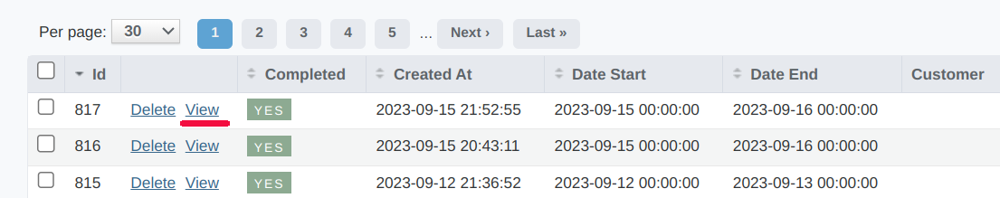
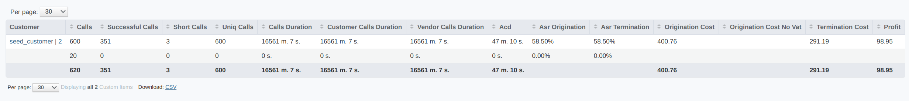

.. _reports:

.. |br| raw:: html

    

=================
Custom CDR report
=================

Custom CDR reports are used for creating customized reports and schedulers (for sending regular reports to the user) about all calls that were passed via Yeti. Following information is provided in this *CDR report*: Calls Count, Calls Duration, ACD (average call duration), ASR (answer-seizure ratio) Origination, ASR Termination, Origination Cost, Termination Cost, Profit.

Reports creation
================

To create report, use **New Custom Cdr report** button. 

    Date start, Date end
        These values defining reporting period. During report generation CDRs will be filtered by **time_start** according to this period.
    Customer
        Optional filter to create report only based on calls from specific :ref:`Customer <contractors>`
    Filter
        Statement (f.e. "vendor_price < 10") that will be used for filtering records during report generation
    Group by
        Attributes of CDR that will be used for grouping records for this report
    Send to
        :ref:`Contact <contacts>` for sending this *CDR report*.

.. note:: It is possible to create scheduler for this type of report. Scheduler will automatically generate report and send it to email. To create scheduler use **Create scheduler** button.

When report will be ready(data collection time may require some time, depends of CDRs count) you can view it:

|br|

Reports data
============

Custom CDR report have two set of columns - Group By colums and Aggregated columns. Group by columns defined by system operator during report creation(using **Group by** attribute). Aggregated columns are predefined:

Сalls
    Total calls count including rerouting attempts.

Successful Calls
    Successfully connected calls count.
    
Short Calls
    Count of successful calls that have duration less then short call duration
    
Uniq Calls
    Unique calls count. If there are few rerouting attempts of same calls only last attempt will be counted
    
Calls Duration
    Total calls duration. This column displays sum of CDRs values
    
Customer_calls_duration
    Total calls billing duration rounded according Destination billing intervals settings(initial_interval and next_interval). This column represents sum of CDRs customer_duration values
    
Vendor_calls_duration
    Total calls billing duration rounded according Dialpeer billing intervals settings(initial_interval and next_interval). This column represents sum of CDRs vendor_duration values

ACD
    Average call duration calculates as Calls Duration/Successful Calls count
    
ASR Origination
    Answer seizure ratio from call originator point of view. If call have multiple rerouting attempts and last attempt was successful, call will be threated as successful during ASR calculation.
    
ASR Termination
    Answer seizure ratio from termination side point of view. If call have multiple rerouting attempts each attemtp will be counted separately during ASR calculation.

Origination Cost
    Total price of calls for originator. This column represents sum of CDRs customer_price values
    
Origination Cost No VAT
    Total price of calls for originator excluding VAT. This column represents sum of CDRs customer_price_no_vat values
    
Termination Cost
    Total price of calls for termination side. This column represents sum of CDRs vendor_price values

Profit
    Total profit. This column represents sum of CDRs profit values
    
