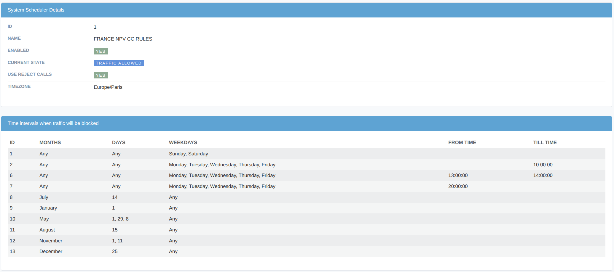

.. _schedulers:

==========
Schedulers
==========

Schedulers provide an automatic mechanism to enable, disable, and toggle the **Reject Calls** flag in **Customer Auth**, **Destination**, **Dialpeer**, and **Gateway** objects.

Scheduler Fields
================

Id
    Unique scheduler identifier.

Name
    User-friendly scheduler name.

Enabled
    Only enabled schedulers are processed by the system.

Use Reject Calls
    When enabled, the scheduler applies the **reject_calls** flag to **Customer Auth** and **Destination** objects to block traffic.

Current State
    The current operational state of the scheduler. The system automatically recalculates this state every 2 minutes.

Timezone
    The timezone that determines when the scheduler operates.

Ranges Configuration
====================

By default, a scheduler allows all traffic. To define when traffic should be blocked, create one or more **ranges**. Range Attributes:

Months
    Months during which blocking will be applied. An empty value means *any month*.

Days
    Days of the month when blocking will be applied. An empty value means *any day of the month*.

Weekdays
    Days of the week when blocking will be applied. An empty value means *any day of the week*.

From Time
    Start time of the blocking period. An empty value means *start of the day*.

Till Time
    End time of the blocking period. An empty value means *end of the day*.

   Example of Scheduler configuration.
