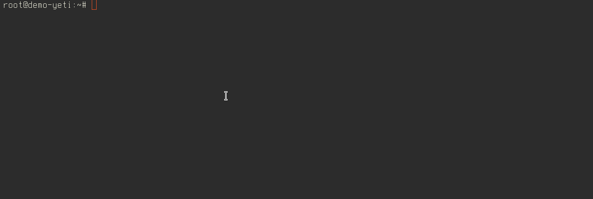

================
Yeti CLI utility
================

yeti-cli utility gives ability to manage yeti cluster via :doc:`SEMS JSONRPC interface <../sems/sems-module-jsonrpc>`. It has frendly console interface with tab completions.

.. toctree::
   :maxdepth: 2
   
   installation.rst
   commands.rst
