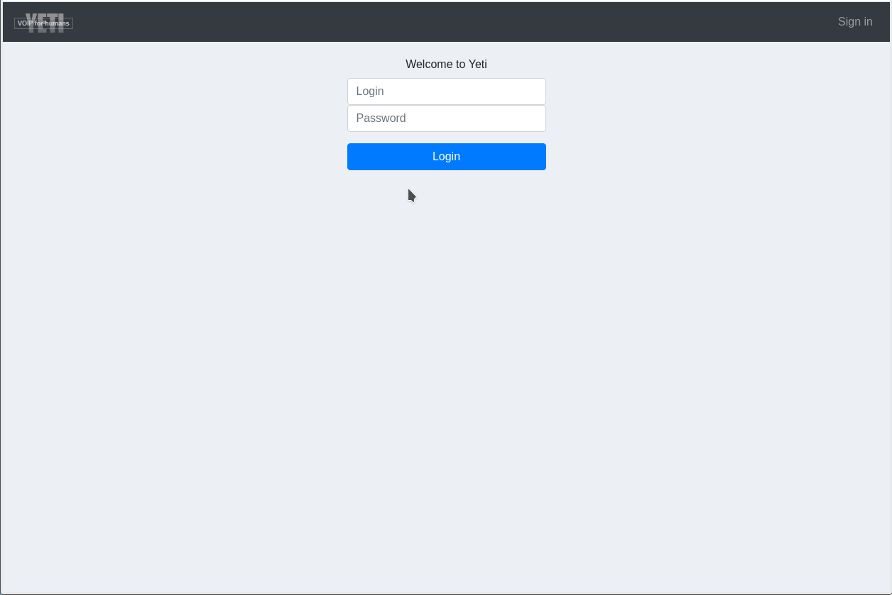

.. _yeti_client:

Customer Portal
===============

YETI Customer portal is `SPA <https://en.wikipedia.org/wiki/Single-page_application>`_ that act as YETI Customer API client. It allow operator who runs YETI to create interface for his customer to fetch customer-specific data like Account information, Rates, CDRs, Call Statistics.

.. warning:: Currently YETI Customer Portal in alpha state so it can't be used in production. But it can use it as example during development your own Customer API clients.

Demo Customer portal instance located at `<https://client.demo.yeti-switch.org>`_, current login/password is **test/test**.

.. note:: Any admin user of demo instance can change login/password at `<https://demo.yeti-switch.org/api_accesses>`_

.. toctree::
   :maxdepth: 2

   installation
   configuration

